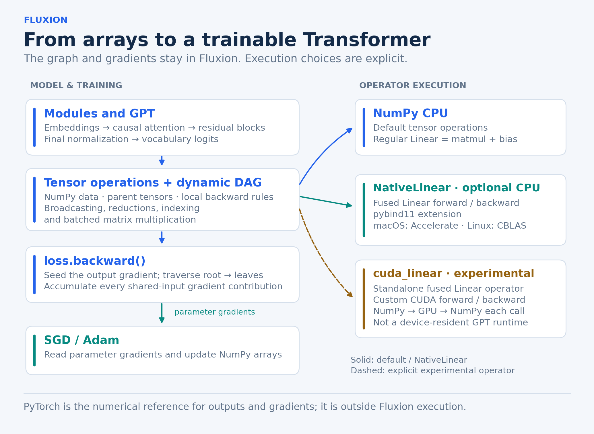
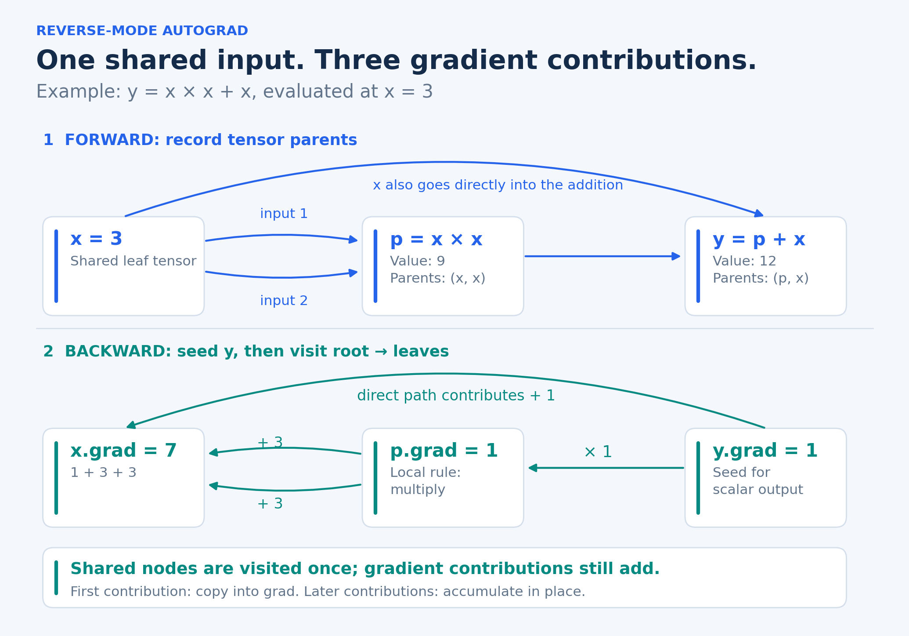
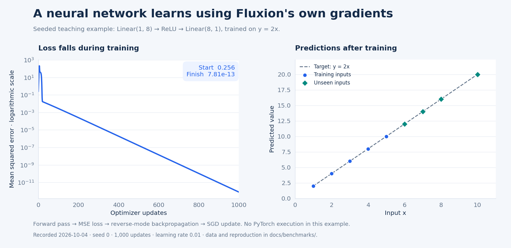
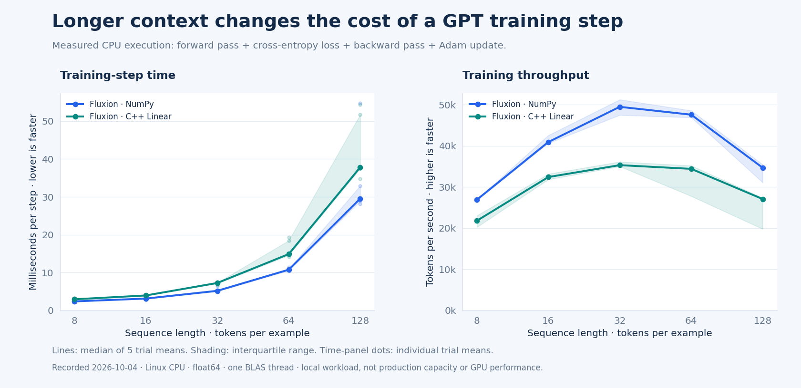

# Fluxion

**Build the machinery behind a neural network, then measure where it spends its time.**

**Python · NumPy · C++ / BLAS · experimental CUDA**

Fluxion is a deep learning engine built from first principles: NumPy-backed tensors, a dynamic computation graph, reverse-mode automatic differentiation, trainable neural-network modules, and a small GPT-style language model. The core engine computes its own gradients. PyTorch provides an independent numerical reference for outputs and gradients.

The same codebase connects three levels of systems work: **a tensor's local derivative**, **a complete Transformer training step**, and **the boundary between Python and native kernels**. You can read each part, train a model, and reproduce the measurements below.

[Try it](#try-it) · [How it works](#how-it-works) · [Measured behavior](#measured-behavior) · [Correctness](#correctness) · [Native backends](#native-backends) · [Visuals and measurements](docs/README.md)

## How it works



A `Tensor` holds an array, its parent tensors, and the backward rule for the operation that produced it. Layers compose those operations into models. Calling `loss.backward()` traverses the graph from the output toward its leaves; an optimizer then updates the trainable arrays.

| Layer of the system | Implemented behavior | Start reading |
|---|---|---|
| Tensor engine | Broadcasting, reductions, indexing, reshape/transpose, batched matrix multiplication | [Tensor](src/fluxion/tensor.py), [operations](src/fluxion/ops.py) |
| Reverse-mode autograd | Topological traversal, local backward rules, shared-input gradient accumulation | [Traversal](src/fluxion/autograd.py), [gradient tests](tests/test_autograd.py) |
| Neural networks | Linear, ReLU, Sigmoid, Softmax, LayerNorm, Embedding; MSE and cross-entropy losses | [Layers](src/fluxion/nn/layers.py), [losses](src/fluxion/nn/losses.py) |
| Training | Recursive parameter discovery, SGD and Adam | [Modules](src/fluxion/nn/module.py), [optimizers](src/fluxion/optim/) |
| Transformer | Multi-head causal attention, learned positions, pre-norm residual blocks, GPT logits | [Attention](src/fluxion/transformer/attention.py), [GPT](src/fluxion/transformer/gpt.py) |
| Native operators | Fused Linear forward/backward in C++/BLAS; experimental custom CUDA Linear kernels | [CPU implementation](native/fluxion_native.cpp), [CUDA implementation](native/cuda/fluxion_cuda.cu) |

### A graph you can inspect in six lines

```python
from fluxion.tensor import Tensor

x = Tensor(3.0, requires_grad=True)
y = x * x + x
y.backward()
print(y.data.item(), x.grad.item())  # 12.0 7.0
```



The shared `x` is visited once in the topological traversal, but every derivative contribution still adds to its gradient. Fluxion copies the first contribution into the gradient buffer and accumulates later contributions in place. Broadcasting has a complementary rule: gradients reduce back to each input's original shape.

## Measured behavior

### Does the complete training loop learn?



The [`train_tiny_network.py`](examples/train_tiny_network.py) example fits `y = 2x` using a `1 → 8 → 1` network, ReLU, mean squared error, and SGD. In the recorded run, loss fell from **0.256 to 7.81 × 10⁻¹³** after 1,000 updates. Predictions for unseen inputs `6, 7, 8, 10` were within `3.57 × 10⁻⁶` of `12, 14, 16, 20`. The figure records the actual forward → loss → backward → update loop; this toy task is a functional check rather than a measure of general model quality.

### How does a GPT training step scale?



Longer sequences change the amount of work in attention and throughout the training graph. This experiment measures the **whole CPU training step**: forward pass, cross-entropy, backward pass, and Adam update. It uses synthetic token IDs and targets to study execution cost, rather than language-model quality.

On the recorded Linux host, regular Fluxion's median step time rose from **2.38 ms at 8 tokens per sequence to 29.53 ms at 128**. NativeLinear was slower at every measured length: **2.94 ms** and **37.83 ms** at those endpoints. NumPy used optimized OpenBLAS while the native extension linked the host's Netlib BLAS; the result includes both those backend differences and the full framework overhead. Moving an operator into C++ does not, by itself, establish a speedup.

The figures above use fresh CPU measurements with recorded trial data, environment details, and reproducible commands. See [measurement details and source data](docs/benchmarks/results.md) before comparing machines or backends. CUDA performance is not measured in these figures.

### What happened when Linear moved into C++?

The earlier macOS experiment found that native Linear improved small and medium GPT workloads but **slowed the large workload**: `9.423 ms` for regular Fluxion versus `10.106 ms` with NativeLinear. Replacing one operator leaves attention, normalization, Python graph bookkeeping, allocation, and dispatch costs in the end-to-end path.

Those original figures are preserved in [historical CPU results](docs/benchmarks/historical-results.md), with their original setup and limitations. They are a separate checkpoint from the fresh charts above. The repository also contains a [controlled gradient-accumulation A/B benchmark](benchmarks/benchmark_autograd_ab.py) and [CPU workload matrix](benchmarks/benchmark_cpu_matrix.py).

## Correctness

**Fresh Linux CPU checkpoint: 72 tests passed; 2 CUDA tests skipped.** The native C++/CBLAS extension was built for this run. Five PyTorch reference checks passed: Linear, LayerNorm, causal attention, TransformerBlock, and GPT. The largest recorded output error was `2.887e-15`; the largest gradient error was `4.263e-14`. Scope, versions, and recorded results are linked in the [measurement details](docs/benchmarks/results.md).

The [test suite](tests/) covers tensor operations, broadcasting and reductions, shared graphs, neural-network layers, optimizers, attention, and Transformer composition. The [PyTorch reference validation](validation/validate_pytorch.py) copies inputs and parameters into an independent implementation, then compares both **forward outputs and reverse-mode gradients**. The validation script reports `PASS`/`CHECK`; the test suite supplies assertion-based checks as well.

For the complete suite, install the reference dependencies and build the CPU extension using the [native setup below](#build-the-portable-cpu-extension). Two neural-network tests invoke NativeLinear directly, so an unbuilt native extension is insufficient for the full suite. CUDA tests skip when the extension/GPU is unavailable; a CPU-only run does not validate CUDA.

Reference checks use float64 and report absolute and relative error. Relative error can look large near a zero-valued reference gradient.

## Try it

Requires **Python 3.11 or newer**. From a fresh clone, the NumPy-only demo works without PyTorch or a compiler:

```bash
git clone https://github.com/michaelbawuah/Fluxion.git
cd Fluxion
python3 -m venv .venv
source .venv/bin/activate
python -m pip install -e .
python examples/train_tiny_network.py
```

The activation command above is for macOS/Linux shells. The Fluxion runtime itself depends on NumPy. PyTorch is an optional dependency used by the tests and reference validation.

For a larger example, [`train_gpt.py`](examples/train_gpt.py) trains a character-level causal model on a short repeated text and samples new characters:

```bash
python examples/train_gpt.py
```

That example demonstrates next-token training and autoregressive generation. Its tiny repeated corpus is a learning exercise, not evidence of broad language understanding.

## Native backends

| Path | Scope | Requirements and current limits |
|---|---|---|
| NumPy | Default tensor operations and regular `Linear`; full CPU training examples | Python + NumPy |
| C++ / BLAS | Explicit `NativeLinear` forward/backward; GPT can opt in with `use_native_linear=True` | C++17 compiler, pybind11, Accelerate on macOS or CBLAS/BLAS development libraries on Linux; float64 |
| CUDA | Explicit `fluxion.ops.cuda_linear(x, weight, bias)` | NVIDIA GPU, CUDA Toolkit/`nvcc`, pybind11; custom kernels with host/device copies and allocation on each call; float64 |

### Build the portable CPU extension

Run these commands from the repository root. On Linux, install a C++ compiler and the BLAS development headers first; for Ubuntu, the packages are `build-essential`, `libopenblas-dev`, and `python3-dev`. On macOS, install the Xcode command-line tools.

```bash
python -m pip install -e ".[dev,reference]" pybind11
python native/build_native.py
PYTHONPATH=src:. python -m pytest -q
PYTHONPATH=src:. python validation/validate_pytorch.py
PYTHONPATH=src:. python benchmarks/benchmark_gpt_native.py
```

The build helper selects Apple Accelerate on macOS and a BLAS library on Linux. The compiled extension is written to the repository root; `PYTHONPATH=src:.` makes both the Python package and that extension available to script subprocesses.

Inspect the compiled backend before comparing timings:

```bash
PYTHONPATH=src:. python -c "from fluxion.native import backend_name, build_info; print(backend_name()); print(build_info())"
```

### Build the experimental CUDA operator

On an NVIDIA CUDA machine after the development/reference install:

```bash
python native/cuda/build_cuda.py
PYTHONPATH=src:. python -m pytest tests/test_cuda_backend.py -q
PYTHONPATH=src:. python benchmarks/benchmark_cuda_linear.py
```

The extension implements Linear forward, input gradients, weight gradients, and bias gradients directly in CUDA. NumPy arrays are copied to the GPU and results are copied back. Persistent device tensors, device-resident GPT training, optimized kernels, and measured GPU comparisons remain future work.

## Reproduce or explore

| Question | Entry point |
|---|---|
| Does a small model learn end to end? | [`examples/train_tiny_network.py`](examples/train_tiny_network.py) |
| How does a Transformer compose the engine? | [`src/fluxion/transformer/gpt.py`](src/fluxion/transformer/gpt.py) |
| Do outputs and gradients match an independent implementation? | [`validation/validate_pytorch.py`](validation/validate_pytorch.py) |
| How does sequence length affect a whole training step? | [`benchmarks/benchmark_scaling.py`](benchmarks/benchmark_scaling.py) |
| Where does the Python CPU path spend its time? | [`benchmarks/profile_gpt.py`](benchmarks/profile_gpt.py) |
| Does a fused native operator improve the full model? | [`benchmarks/benchmark_gpt_native.py`](benchmarks/benchmark_gpt_native.py), [`benchmark_cpu_matrix.py`](benchmarks/benchmark_cpu_matrix.py) |
| How are the README figures made? | [Diagram renderer](docs/media/render_diagrams.py), [chart renderer](docs/media/render_charts.py), [measurement details](docs/benchmarks/results.md) |

Fluxion is an educational systems project with readable implementations and explicit experimental boundaries. The next useful work is to profile the measured bottlenecks, improve backend residency and build tooling, expand reference coverage, and rerun complete-workload comparisons after each change.
